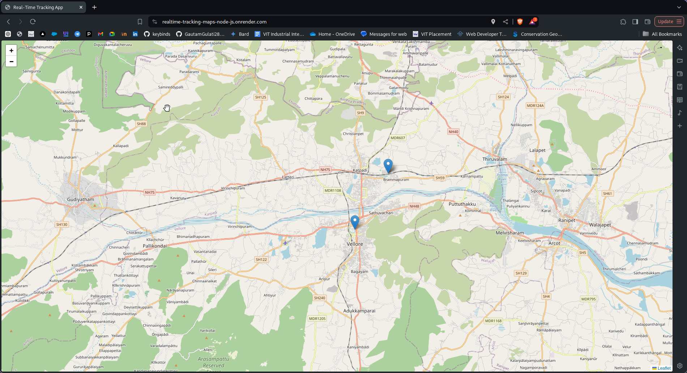
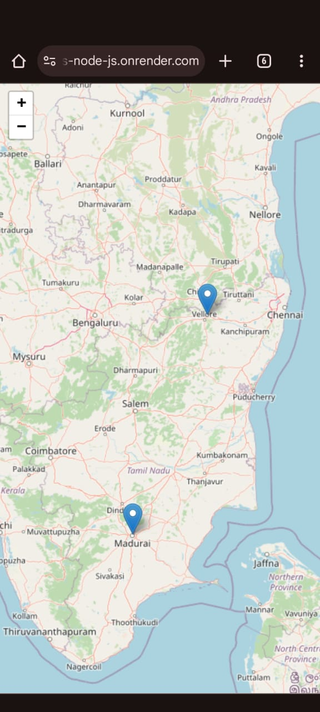

# Real-Time Map Tracking App

This is a real-time tracking application that displays the location of every online device on an interactive map. The map updates every 5 seconds to reflect the latest positions of the devices. This project leverages Node.js for the backend server, Socket.io for real-time communication, Leaflet for interactive maps, and EJS for templating.





## Features

- Real-time location updates every 5 seconds.
- Interactive map using Leaflet.js.
- Displays the location of all connected devices.
- Initial map view centers on your location when the website is first opened.

## Project Structure

- **Backend:** Node.js, Express.js
- **Real-time Communication:** Socket.io
- **Frontend:** EJS, Leaflet.js
- **Templating:** EJS

## Setup and Installation

To get this project up and running locally, follow these steps:

### Prerequisites

- **Node.js** installed on your machine.

### Installation

1. Clone the repository:

   ```bash
   git clone https://github.com/GautamGulati28/realtime-tracking-maps-node.js.git
   cd realtime-tracking-maps-node.js
   ```

2. Install dependencies:

   ```bash
   npm install
   ```

3. Run the application:

   ```bash
   npx nodemon app.js
   ```

   This will start the server and your application will be accessible at `http://localhost:3000`.

## Deployment

This project is currently deployed and can be accessed live at: [Real-Time Tracking App](https://realtime-tracking-maps-node-js.onrender.com)

## How It Works

1. **Real-time Updates:** 
   - The server pushes location updates to all connected clients every 5 seconds using Socket.io.
   - The frontend receives these updates and updates the map accordingly.

2. **Map Interaction:**
   - The map initially centers on your current location when you first open the site.
   - After that, it doesn't recenter on your location, allowing you to explore other areas freely.
